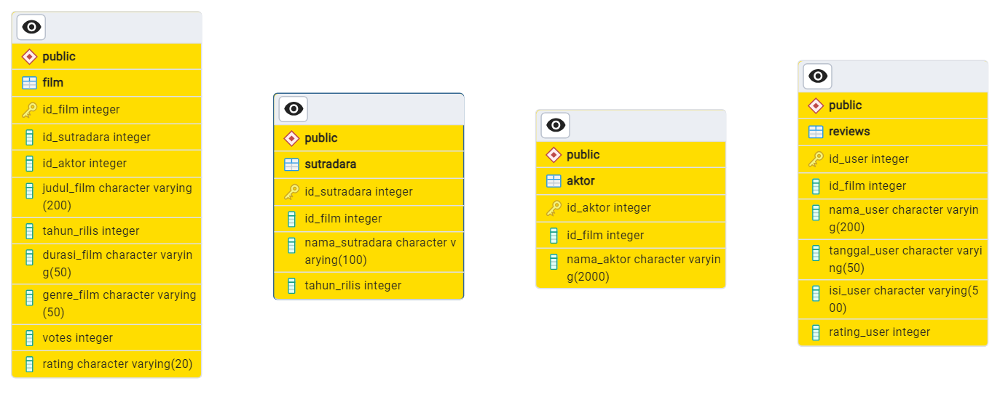

<p align="center">
  
</p>

<div align="center">

# INMOVIE Database

[Info](#scroll-Info)
•
[Screenshot](#rice_scene-screenshot)
•
[Demo](#dvd-demo)
•
[Dokumentasi](#blue_book-dokumentasi)

</div>
Sering galau mau nonton film apa karena takut filmnya tidak sesuai ekspektasi? udahhh tenang aja, INMOVIE jawabannya! 
Semua informasi penting tentang karya sinematik Indonesia sudah terangkum di sini. Butuh informasi tentang aktor, sutradara, atau bahkan ulasan? Ada! it's time to dive into films!


**Apa itu INMOVIE?**
INMOVIE adalah sistem database film Indonesia yang diciptakan untuk merinci dan mengorganisir informasi terkait film, seperti daftar pemeran, sutradara, tanggal rilis, genre, dan lebih banyak lagi. Ini adalah perpustakaan digital yang menyediakan akses cepat dan efisien ke seluruh spektrum film.
it's time to dive into films!

**Apa saja yang ditemui dalam INMOVIE?**

  **Informasi Film**: Data utama tentang judul film, aktor, sutradara.

  **Ulasan dan Peringkat**: Komentar dan penilaian kritikus.

  **Tanggal Rilis**: Kapan film ini pertama kali hadir di layar lebar.

  **Genre**: Kategori atau jenis film yang dapat membantu penonton memilih sesuai selera.

**Penggunaan INMOVIE**

1. **Penonton**: Memberikan referensi untuk memilih film sesuai dengan preferensi.
2. **Analisis Tren**: Mengetahui 5 film terbaik berdasarkan rating.


**Kami Mengajak Anda menyelam ke Dunia Film!**
Dunia film akan selalu menarik dan dinamis, tak heran penonton kehausan menjelajah film-film yang berkualitas. Mencari, menilai, dan memilih film memang menarik namun tak kalah melelahkan. INMOVIE dirancang untuk membantu mengeksplorasi dan menyelami setiap aspek dari produksi film hingga interaksi penonton. Siapkan diri Anda untuk berpetualang dalam dunia film yang penuh warna bersama INMOVIE.

</div>

## :bookmark_tabs: Menu

- [Tentang](#scroll-tentang)
- [Screenshot](#rice_scene-screenshot)
- [Demo](#dvd-demo)
- [Dokumentasi](#blue_book-dokumentasi)
- [Requirements](#exclamation-requirements)
- [Skema Database](#floppy_disk-skema-database)
- [ERD](#rotating_light-erd)
- [Deskripsi Data](#heavy_check_mark-deskripsi-data)
- [Struktur Folder](#open_file_folder-struktur-folder)
- [Tim Pengembang](#smiley_cat-tim-pengembang)

## INFO
**INMOVIE** adalah portal informasi terkait database film dari berbagai studio dan produksi film. Kami menyajikan data yang akurat dan terkini tentang film-film terkemuka, membantu Anda menjelajahi dan menemukan karya sinematik yang sesuai dengan selera Anda. 


## Dashboard Database
<p align="center">
  
</p>

## :dvd: Demo

Berikut merupakan link untuk shinnyapps atau dashboard dari project kami:
https://akmarinak98.shinyapps.io/database_publikasi_statistika/

## :blue_book: Dokumentasi 

Dokumentasi penggunaan aplikasi database. Anda dapat juga membuat dokumentasi lives menggunakan readthedocs.org (opsional).

## :exclamation: Requirements
- Data diperoleh dari (https://www.imdb.com/) dengan memilih film indonesia terbaru dari 2018-2024 menggunakan scarapping parsehub. 
- RDBMS yang digunakan adalah PostgreSQL dan ElephantSQL
- Dashboard menggunakan `shinny`, `shinnythemes`, `bs4Dash`, `DT`, dan `dplyr` dari package R
- 
## :floppy_disk: Skema Database
Menggambarkan struktur *primary key* **film**, **aktor**, **sutradara**, **reviews** dan **aktor-film** dengan masing-masing *foreign key* dalam membangun relasi antara tabel atau entitas.

<p align="center" style="width: 800px; height: 200px;">
  
</p>


## :rotating_light: ERD
ERD (Entity Relationship Diagram) menampilkan hubungan antara entitas dengan atribut.

<p align="center" style="wdoc/ERD FILM.png">
  
</p>

## :heavy_check_mark: Deskripsi Data
INMOVIE adalah sumber terpercaya untuk mendapatkan informasi lengkap tentang film-film terkemuka. Data yang kami sajikan mencakup detail film, ulasan, pemain, dan semua informasi penting lainnya. Dengan menggabungkan keahlian dalam teknologi informasi dan kecintaan kami pada dunia film, kami berkomitmen untuk menyediakan pengalaman eksplorasi film yang tak tertandingi.Berisi tentang tabel-tabel yang digunakan berikut dengan sintaks SQL DDL (CREATE).

### Create Database
Databse INMOVIES menyimpan informasi yang mewakili atribut data yang saling berhubungan untuk kemudian dianalisis.
```sql
CREATE DATABASE film_indo
    WITH
    OWNER = postgres
    ENCODING = 'UTF8'
    CONNECTION LIMIT = -1
    IS_TEMPLATE = False;
```
### Create Table film
Table film memberikan informasi kepada user mengenai identitas film novel Indonesia, sehingga user dapat mengetahui id film, nama sutradara, judul film, tahun rilis, genre, votes dan rating. Id film adalah kode yang digunakan untuk membedakan judul film yang sama pada tiap film. Berikut deskripsi untuk setiap tabel penulis.
| Attribute          | Type                  | Description                     |
|:-------------------|:----------------------|:------------------------|
| id_film            | varchar(200)          | Id film                 |
| id_sutradara       | varchar(50)           | Id sutradara            |
| judul_film         | varchar(200)          | judul Film              |
| tahun_rilis        | int 	             | tahun rilis             |
| durasi_film        | varchar(50)           | Durasi film             |
| genre_film         | varchar(50)           | Genre Film              |
| votes              | int 	             | Votes film              |
| rating             | varchar(50)	     | rating film   	       |

dengan script SQL sebagai berikut:
```sql
CREATE TABLE IF NOT EXISTS public.film (
    id_film int NOT NULL,
	id_sutradara int NOT NULL,
    judul_film varchar(200) NOT NULL,
    tahun_rilis int,
	durasi_film varchar(50),
	genre_film varchar(50),
	votes int,
	rating varchar(20),
	PRIMARY KEY (id_film)	
);


SELECT * FROM film;

);
```
### Create Table Aktor
Table aktor memberikan informasi yang memudahkan user mengetahui informasi dari nama aktor film Indonesia tersebut melalui id aktor dan nama aktor yang memainkan film. Id aktor adalah kode yang digunakan untuk membedakan nama aktor yang sama pada tiap film. Berikut deskripsi untuk setiap tabel penerbit.
| Attribute          | Type                  | Description                     	|
|:-------------------|:----------------------|:---------------------------------|
| id_aktor           | int		     | Id Aktor			       	|
| nama_aktor         | varchar(100) 	     | Nama Aktor Film                  |

dengan script SQL sebagai berikut:
```sql
CREATE TABLE IF NOT EXISTS public.aktor (
    id_aktor int NOT NULL,
    nama_aktor varchar(100),
    PRIMARY KEY (id_aktor)
);

SELECT * FROM aktor;
```
### Create Table Sutradara
Table Sutradara memberikan informasi kepada user mengenai informasi terkait Sutradara Film Indonesia. User dapat mengetahui id sutradara, nama sutradara dan id_film untuk menghubungkan ke film.
| Attribute              | Type                  | Description                     		       |
|:-----------------------|:----------------------|:----------------------------------------------------|
| id_sutradara           | int 			 | Id Sutradara                     	     	       |
| id_film                | int 			 | Id Film                  	    		       |
| nama_sutradara            | varchar(100)  	 | Id Sutradara                    		       |	

dengan script SQL sebagai berikut:
```sql
CREATE TABLE IF NOT EXISTS public.sutradara (
    id_sutradara int PRIMARY KEY,
    id_film int NOT NULL,
    nama_sutradara varchar(100),
	tahun_rilis int,
    CONSTRAINT film_id_film_fkey FOREIGN KEY (id_film)
        REFERENCES public.film (id_film) MATCH SIMPLE
        ON UPDATE NO ACTION
        ON DELETE NO ACTION
);


SELECT * FROM sutradara;
```

### Create Table Reviews
Table Reviews menyajikan informasi lengkap mengenai informasi Reviews dari para penonton film. Selain dapat mengetahui judul, user juga akan mendapatkan informasi doi dan tahun terbit sebuah film. Nama aktor, nama sutradara hingga urutan aktor tersaji pada table ini. Tidak hanya itu, akan ditampilkan pula nama sutradara yang menyutradarakan film. Lebih lanjut, Berikut deskripsi untuk setiap tabel reviews.
| Attribute                  | Type                  | Description                     		       |
|:---------------------------|:----------------------|:------------------------------------------------|
| id_user                    | integer 	    	     | Id User                       		       |
| id_film                    | integer               | Id Film                 			       |
| nama_user                  | varchar(100)          | Nama user yang Memberikan Reviews               |	
| tanggal_user        	     | varchar(50)           | Tanggal Pembaca Mengirim Ulasan                 |
| isi_user                   | varchar(500)          | Komentar yang Diberikan Penonton Terhadap Film  |
| rating_user   	     | integer               | Peringkat yang Diberikan Penonton Terhadap Film |


dengan script SQL sebagai berikut:              
```sql
CREATE TABLE IF NOT EXISTS public.reviews (
    id_user int NOT NULL,
    id_film int NOT NULL,
    nama_user varchar(200),
    tanggal_user varchar(50),
    isi_user varchar(500),
    rating_user int,
    CONSTRAINT reviews_pkey PRIMARY KEY (id_user),
    CONSTRAINT reviews_id_film_fkey FOREIGN KEY (id_film)
        REFERENCES public.film (id_film) MATCH SIMPLE
        ON UPDATE NO ACTION
        ON DELETE NO ACTION
);

SELECT * FROM reviews;
```

## :open_file_folder: Struktur Folder

```
.
├── app           # ShinyApps
│   ├── css
│   │   ├── **/*.css
│   ├── server.R
│   └── ui.R
├── data 
│   ├── csv
│   │   ├── **/*.css
│   └── sql
|       └── db.sql
├── src           # Project source code
├── doc           # Doc for the project
├── .gitignore
├── LICENSE
└── README.md
```

## Tim Pengembang
+ Database Manager : [Dwi Fitrianti](https://github.com/dwifitrianti) (G1501231013)
+ Frontend Developer : [Eka Dicky Darmawan Yanuari](https://github.com/EkaDickyDarmawanYanuari) (G1501231088)
+ Backend Developer : [Siti Hafsah](https://github.com/sitihafsah12) (G1501231060)
+ Technical Writer : [Reza Arianti](https://github.com/RezaArianti) (G1501231039)
